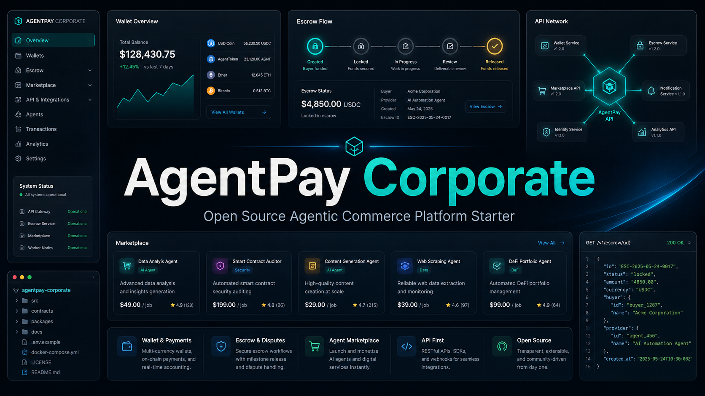

# AgentPay Corporate

AgentPay Corporate is an open-source agentic commerce platform starter for wallet, escrow, marketplace, seller-service, and API launch workflows. It includes a public website, clickable MVP console, backend starter, database schemas, OpenAPI contract, deployment runbooks, and launch-control documentation.

The project is released under the MIT License. Paid commercial activity should be positioned around implementation support, customization, hosting, training, compliance planning, or managed deployment services rather than restricting access to the source package itself.

## Included

- Branded AgentPay logo and favicon
- Responsive corporate landing page
- Static MVP product console at `app.html`
- Console views for dashboard, wallet, agents, marketplace, seller publishing, escrow, admin, and API keys
- Product, wallet, escrow, marketplace, seller, security, trust, investor, contact, and API sections
- Interactive page navigation and demo console preview
- PostgreSQL schema blueprint in `backend/schema.sql`
- Migration-ready PostgreSQL baseline in `backend/migrations/`
- OpenAPI contract in `backend/openapi.yaml`
- API route implementation map in `backend/API_ROUTE_MAP.md`
- Escrow transition rules in `backend/ESCROW_STATE_MACHINE.md`
- Backend deployment checklist in `backend/DEPLOYMENT_CHECKLIST.md`
- MongoDB listing discovery schema in `backend/mongo-listing-document.schema.json`
- MongoDB seed data in `backend/mongo-listing-seed.json`
- Visible listing catalog in `backend/listing-catalog.json`
- Listing purchase requirement schemas in `backend/listing-schemas/`
- Flagship marketplace listing schema in `backend/listing-schemas/agentpay-corporate-deployment.v1.json`
- Optional PocketBase prototype backend plan in `backend/pocketbase/`
- Backend environment template in `backend/.env.example`
- Portable Node.js backend starter in `backend-service/`
- Hostinger Cloud deployment guide
- Phase 2 Hostinger deployment notes in `docs/HOSTINGER_PHASE2_DEPLOYMENT.md`
- Phase 2 MVP blueprint in `docs/PHASE2_MVP_BLUEPRINT.md`
- User quickstart in `docs/BUYER_QUICKSTART.md`
- Gumroad sales page copy in `docs/GUMROAD_SALES_PAGE.md`
- Examples and troubleshooting in `docs/EXAMPLES_AND_TROUBLESHOOTING.md`
- Final commercial release checklist in `docs/FINAL_RELEASE_CHECKLIST.md`
- Screenshot index in `docs/SCREENSHOT_INDEX.md`
- Buyer-facing screenshots in `docs/screenshots/`
- License and usage terms in `docs/LICENSE_AND_USAGE.md`
- Changelog in `docs/CHANGELOG.md`
- Buyer verification guide in `docs/BUYER_VERIFICATION_GUIDE.md`
- Support and refund policy in `docs/SUPPORT_AND_REFUND_POLICY.md`
- Customization workbook in `docs/CUSTOMIZATION_WORKBOOK.md`
- Marketplace upload pack in `docs/MARKETPLACE_UPLOAD_PACK.md`
- Buyer acceptance test in `docs/BUYER_ACCEPTANCE_TEST.md`
- Implementation scope pack in `docs/IMPLEMENTATION_SCOPE_PACK.md`
- Post-purchase onboarding pack in `docs/POST_PURCHASE_ONBOARDING_PACK.md`
- Demo and sales call pack in `docs/DEMO_AND_SALES_CALL_PACK.md`
- Pricing and ROI pack in `docs/PRICING_AND_ROI_PACK.md`
- Open-source commercial services pack in `docs/LICENSE_TIERS_AND_RESELLER_PACK.md`
- Update and maintenance pack in `docs/UPDATE_AND_MAINTENANCE_PACK.md`
- Compliance and risk disclosure pack in `docs/COMPLIANCE_AND_RISK_DISCLOSURE_PACK.md`
- Enterprise due diligence pack in `docs/ENTERPRISE_DUE_DILIGENCE_PACK.md`
- PocketBase rapid backend pack in `docs/POCKETBASE_RAPID_BACKEND_PACK.md`
- Security remediation pack in `docs/SECURITY_REMEDIATION_PACK.md`
- Security operations and incident response pack in `docs/SECURITY_OPERATIONS_AND_INCIDENT_RESPONSE_PACK.md`
- Commercial launch and distribution pack in `docs/COMMERCIAL_LAUNCH_AND_DISTRIBUTION_PACK.md`
- Customer success and retention pack in `docs/CUSTOMER_SUCCESS_AND_RETENTION_PACK.md`
- Product roadmap and backlog pack in `docs/PRODUCT_ROADMAP_AND_BACKLOG_PACK.md`
- Revenue operations tracker pack in `docs/REVENUE_OPERATIONS_TRACKER_PACK.md`
- Privacy and data governance pack in `docs/PRIVACY_AND_DATA_GOVERNANCE_PACK.md`
- Investor and partner briefing pack in `docs/INVESTOR_AND_PARTNER_BRIEFING_PACK.md`
- Market validation and pilot pack in `docs/MARKET_VALIDATION_AND_PILOT_PACK.md`
- Procurement and RFP response pack in `docs/PROCUREMENT_AND_RFP_RESPONSE_PACK.md`
- Client implementation handoff pack in `docs/CLIENT_IMPLEMENTATION_HANDOFF_PACK.md`
- Partner/channel enablement pack in `docs/PARTNER_CHANNEL_ENABLEMENT_PACK.md`
- Enterprise account expansion pack in `docs/ENTERPRISE_ACCOUNT_EXPANSION_PACK.md`
- Executive steering and reporting pack in `docs/EXECUTIVE_STEERING_AND_REPORTING_PACK.md`
- Team training and adoption pack in `docs/TEAM_TRAINING_AND_ADOPTION_PACK.md`
- Release manifest in `RELEASE_MANIFEST.md`
- Checksums in `RELEASE_SHA256SUMS.txt`; the buyer ZIP checksum is distributed alongside the archive as `agentpay-corporate.zip.sha256`
- Open-source release checklist
- Product cover image in `docs/product-images/agentpay-corporate-open-source-cover.png`

## Open Locally

Open `index.html` in a browser for the public website.
Open `app.html` for the MVP product console preview.

## Open-Source Use

You may copy, modify, publish, distribute, sublicense, and sell services around this project under the included `LICENSE`.

You must keep production safety boundaries visible when presenting or modifying the project. AgentPay Corporate is not a licensed financial product, not a live payment processor, and not a substitute for legal, compliance, payment, privacy, or security review.

## Deployment

For static hosting, upload the contents of this folder to a website document root, normally `public_html`, or connect the folder through Git deployment.

See `HOSTINGER_DEPLOYMENT.md`.

## Backend Status

The console is a frontend prototype with local sample data. The production backend for wallet ledger, escrow, Binance Pay webhooks, API keys, PostgreSQL, MongoDB discovery, Redis, and admin workflows should be implemented separately before any live payment or user-data collection.

Financial amounts must remain decimal strings in APIs and `NUMERIC(36, 18)` in PostgreSQL. MongoDB is only for searchable listing discovery content; settlement and escrow records belong in PostgreSQL.

`backend-service/` is included as a Phase 4 starter. It validates decimal-string money values, exposes the first listing, listing-schema discovery, order, escrow, and admin audit routes, verifies signed starter agent requests, verifies Binance Pay webhook signatures, records audit events, enforces escrow transitions, and includes Node.js tests. It uses in-memory storage only and must be connected to PostgreSQL, MongoDB, Redis, production auth, durable audit logging, durable archive delivery, and verified payment reconciliation before production use.

Phase 5 adds production repository scaffolding: transaction-safe PostgreSQL settlement queries, a PostgreSQL settlement repository, a MongoDB discovery repository, SQL tests for `money_amount` casting and escrow balance guards, and an API server deployment runbook. The repository pack is source-ready but still requires real deployment secrets and database connections before use.

Phase 6 adds the Hostinger Node.js capability decision. Current Hostinger static hosting remains good for the website and console, but the inspected account did not expose Node.js, npm, pm2, or Passenger over SSH. Use a dedicated API server or managed API host for `api.zebepay.com` unless a verified Hostinger Node runtime is enabled separately.

Phase 7 adds the dedicated API server provisioning package: Docker Compose, Nginx, systemd, healthcheck, backup scripts, and a step-by-step `api.zebepay.com` provisioning plan. This prepares deployment without changing DNS or activating a live backend.

Phase 8 adds the dedicated API deployment bundle: production env template, target-server provisioning script, PostgreSQL migration script, MongoDB seed import script, smoke test script, rollback script, and deployment bundle documentation.

The API server release archive is published as `releases/agentpay-api-server-bundle.tar.gz`.

Phase 9 adds API server target assessment. No dedicated target is verified yet: `api.zebepay.com` still resolves to Hostinger infrastructure, and a prior server inspection hit an SSH host-key change stop condition. Provision only after a trusted server target is confirmed.

Phase 10 adds production launch control: SSH target fingerprint verification, DNS cutover runbook, go/no-go launch gates, rollback decision records, and payment activation stop conditions.

Phase 11 adds launch polish: quickstart, listing copy, service pricing guidance, practical examples, troubleshooting notes, and final release checklist.

Phase 12 adds visual proof assets: desktop and mobile screenshots for the public website, console dashboard, marketplace, and escrow views, plus a screenshot index for sales listing use.

Phase 13 adds commercial handoff integrity: license and usage terms, changelog, release manifest, and checksum files for release verification.

Phase 14 adds buyer confidence verification: a buyer-facing verification guide for checksum validation, archive inspection, local preview, backend starter tests, and production boundary confirmation.

Phase 15 adds post-sale buyer assurance: support scope, refund-policy wording, pre-purchase disclosures, and a handoff reply template for marketplace delivery.

Phase 16 adds agency customization support: buyer intake, first-hour customization steps, demo readiness checks, paid implementation upsell packages, and client handoff controls.

Phase 17 adds marketplace upload support: ready-to-paste listing metadata, tags, gallery captions, FAQ, upload checklist, and buyer disclosure wording.

Phase 18 adds buyer acceptance testing: an end-to-end acceptance checklist for archive integrity, required files, website pages, console views, backend tests, checksums, docs, and production boundaries.

Phase 19 adds implementation scope support: offer ladder, discovery questions, quote template, statement-of-work outline, change-control rules, delivery checklist, and production boundary language for paid setup or customization services.

Phase 20 adds post-purchase onboarding support: buyer delivery message, first-24-hour email, day-3 verification follow-up, day-7 upsell follow-up, support intake form, review request, refund-prevention checklist, and escalation paths.

Phase 21 adds demo and sales-call support: demo flow, objection handling, close options, follow-up email, call notes, and demo quality checklist for buyers, sellers, agencies, and investor conversations.

Phase 22 adds pricing and ROI support: price ladder, ROI worksheet, discount rules, objection responses, offer bundle copy, upsell decision tree, and pricing checklist for sellers and agencies.

Phase 23 adds open-source commercial-services support: MIT License positioning, paid service guidance, marketplace wording, quote notes, redistribution risk controls, and service checklist.

Phase 24 adds update and maintenance support: versioning model, update types, patch-release checklist, buyer update note, compatibility note, maintenance boundaries, priority rules, archive refresh notes, and maintenance checklist.

Phase 25 adds compliance and risk disclosure support: regulated-activity warnings, production readiness boundaries, privacy checklist, KYC/AML readiness checklist, security risk register, buyer disclosure block, pre-launch questions, agency notes, stop conditions, and final risk checklist.

Phase 26 adds enterprise due-diligence support: procurement questionnaire, security review notes, privacy review notes, compliance review notes, evidence map, vendor handoff note, approval gates, red flags, and final due-diligence checklist.

Phase 27 adds optional PocketBase rapid backend support: prototype/admin use cases, collection planning files, setup flow, frontend integration notes, security hardening checklist, JS hook warning, migration path to PostgreSQL production, and buyer disclosure wording.

Phase 28 adds security remediation support: admin audit endpoint authorization when a secret is configured, rollback script guardrails, escaped frontend demo template values, authorization tests, and buyer-facing security remediation notes.

Phase 29 adds security operations and incident-response support: secret rotation, admin access review, backup response, vulnerability intake, severity guide, payment stop conditions, incident flow, buyer communication template, and post-incident checklist.

Phase 30 adds commercial launch and distribution support: launch positioning, launch-day checklist, channel priorities, marketplace QA, launch announcement, outreach message, agency angle, affiliate notes, KPI tracking, post-launch follow-up, review request, risk controls, and distribution checklist.

Phase 31 adds customer success and retention support: first-week success cadence, buyer health signals, support triage, setup rescue flow, training agenda, testimonial request, maintenance offer wording, refund-prevention checklist, and metrics tracker.

Phase 32 adds product roadmap and backlog support: MVP stages, feature backlog, prioritization matrix, acceptance criteria template, production stop conditions, roadmap call agenda, and final roadmap checklist.

Phase 33 adds revenue operations support: pipeline stages, tracker columns, KPI dashboard, conversion formulas, weekly review, follow-up templates, risk register, maintenance tracker, and final revenue operations checklist.

Phase 34 adds privacy and data governance support: data boundary summary, data inventory template, privacy notice checklist, minimum data rule, access governance, retention planning, data request workflow, production stop conditions, and final privacy governance checklist.

Phase 35 adds investor and partner briefing support: one-page brief, positioning statement, partner fit matrix, investor talking points, strategic use cases, briefing agenda, due-diligence evidence map, follow-up email, red flags, and final briefing checklist.

Phase 36 adds market validation and pilot support: validation targets, discovery questions, scorecard, pilot scope template, paid pilot offer ladder, feedback log, pilot readiness checklist, follow-up email, and final validation checklist.

Phase 37 adds procurement and RFP response support: procurement positioning, RFP answer library, evidence map, intake checklist, risk-control answer rules, response template, follow-up email, and final procurement checklist.

Phase 38 adds client implementation handoff support: handoff positioning, package summary, handoff checklist, customization record, client review agenda, training notes, open decisions log, handoff email, revision request template, and final handoff checklist.

Phase 39 adds partner/channel enablement support: partner positioning, ideal partner types, qualification checklist, channel offer ladder, outreach copy, onboarding agenda, deal registration, claim-control rules, revenue-share notes, handoff email, partner risk register, and final partner checklist.

Phase 40 adds enterprise account expansion support: expansion positioning, account stage map, discovery questions, offer ladder, stakeholder map, follow-up email, account tracker, expansion risk controls, and final expansion checklist.

Phase 41 adds executive steering and reporting support: steering positioning, executive status snapshot, meeting agenda, decision brief template, KPI table, steering risk register, monthly executive report, escalation rules, and final steering checklist.

Phase 42 adds team training and adoption support: adoption positioning, audience map, 60-minute training agenda, role assignment matrix, adoption scorecard, follow-up email, adoption risk controls, and final adoption checklist.

Post-Phase 42 publishing sprint freezes product-building and adds the flagship `AgentPay Enterprise Node Deployment Package` marketplace listing, machine-readable `/api/v1/listings/agentpay-corporate/schema` discovery path, `/api/v1/sandbox/client-environment` test route, buyer-agent intake schema, visible console/marketplace/sandbox listing, and escrow-locked archive delivery proof metadata. Live USDT settlement and production archive delivery still require deployment approval and completed launch-control gates.
